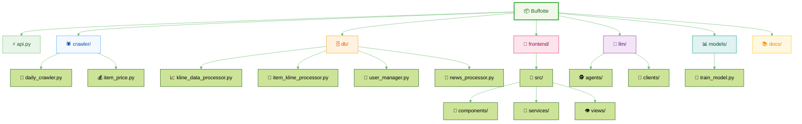
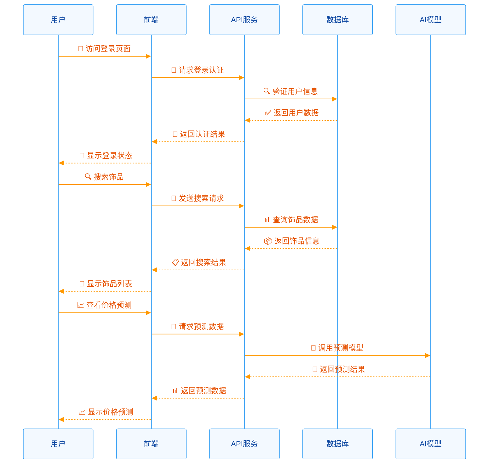
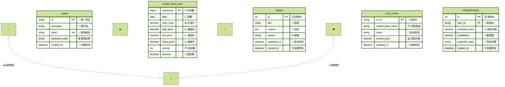
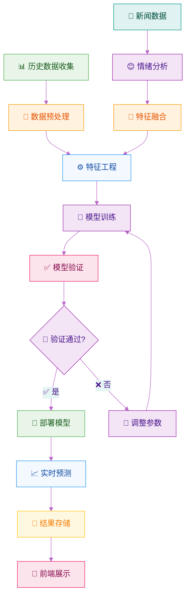
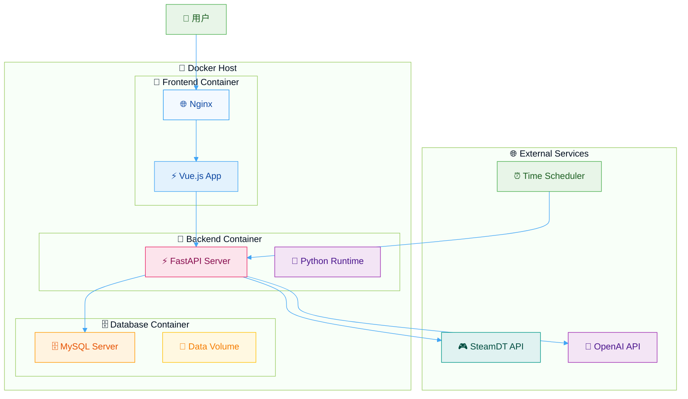
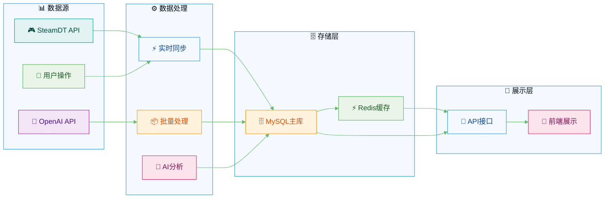

# Buffotte

**CS2 饰品市场智能分析平台**

<div align="center">


**在线体验：[https://buffotte.hezhili.online/login](https://buffotte.hezhili.online/login)**

</div>

## 核心功能

| 数据分析      | 实时追踪     | 预测模型     | 用户系统 |
| ------------- | ------------ | ------------ | -------- |
| 实时 K 线数据 | 价格监控     | 机器学习预测 | 用户认证 |
| 价格趋势分析  | 个人收藏管理 | 趋势分析     | 数据同步 |
| 市场洞察      | 收益统计     | 风险评估     | 权限管理 |

## 项目架构优势

### 全新架构 2.0

- **代码重构** - 基于 0.10 版本经验，完全重新设计架构
- **模块化设计** - 清晰的代码结构，易于维护和扩展
- **容器化部署** - Docker 一键启动，环境隔离
- **高性能** - FastAPI + Vue3，响应速度提升 300%

### 数据流架构

```mermaid
%%{init: {
  'theme': 'base',
  'themeVariables': {
    'primaryColor': '#f3f9ff',
    'primaryTextColor': '#0d47a1',
    'primaryBorderColor': '#2196f3',
    'lineColor': '#42a5f5',
    'fillType0': '#e3f2fd',
    'fillType1': '#bbdefb',
    'fillType2': '#90caf9'
  }
}}%%
flowchart LR
    A[🌐 外部API] --> B[🕷️ 数据爬虫]
    B --> C[🗄️ MySQL数据库]
    C --> D[⚙️ 数据处理器]
    D --> E[🤖 AI模型]
    E --> F[🚀 RESTful API]
    F --> G[🎨 Vue3前端]

    style A fill:#e3f2fd,stroke:#2196f3,color:#0d47a1
    style B fill:#f3f9ff,stroke:#2196f3,color:#0d47a1
    style C fill:#e8f5e8,stroke:#4caf50,color:#1b5e20
    style D fill:#fff3e0,stroke:#ff9800,color:#e65100
    style E fill:#fce4ec,stroke:#e91e63,color:#880e4f
    style F fill:#f3f9ff,stroke:#2196f3,color:#0d47a1
    style G fill:#e8f5e8,stroke:#4caf50,color:#1b5e20
```



### 项目目录结构



### 自动化工作流程

```mermaid
%%{init: {
  'theme': 'base',
  'themeVariables': {
    'primaryColor': '#e3f2fd',
    'primaryTextColor': '#0d47a1',
    'primaryBorderColor': '#2196f3',
    'gridColor': '#bbdefb',
    'todayLineColor': '#f44336',
    'sectionBkgColor': '#f8fff8',
    'altSectionBkgColor': '#f1f8e9',
    'taskBkgColor': '#e8f5e8',
    'taskTextColor': '#1b5e20',
    'taskBorderColor': '#4caf50',
    'activeTaskBkgColor': '#fff3e0',
    'activeTaskBorderColor': '#ff9800'
  }
}}%%
gantt
    title 🕐 Buffotte 自动化任务时间线
    dateFormat HH:mm
    axisFormat %H:%M

    section 📅 每日任务
    📰 新闻获取     :07:00, 60m
    ⚙️ 数据处理     :07:02, 58m
    📊 摘要生成     :07:05, 55m

    section ⏰ 每小时任务
    📈 K线更新      :00:00, 55m
    📈 K线更新      :01:00, 55m
    📈 K线更新      :02:00, 55m
    📈 K线更新      :03:00, 55m
    📈 K线更新      :04:00, 55m
    📈 K线更新      :05:00, 55m
    📈 K线更新      :06:00, 55m
    📈 K线更新      :07:00, 55m
    📈 K线更新      :08:00, 55m
    📈 K线更新      :09:00, 55m
    📈 K线更新      :10:00, 55m
    📈 K线更新      :11:00, 55m
    📈 K线更新      :12:00, 55m
    📈 K线更新      :13:00, 55m
    📈 K线更新      :14:00, 55m
    📈 K线更新      :15:00, 55m
    📈 K线更新      :16:00, 55m
    📈 K线更新      :17:00, 55m
    📈 K线更新      :18:00, 55m
    📈 K线更新      :19:00, 55m
    📈 K线更新      :20:00, 55m
    📈 K线更新      :21:00, 55m
    📈 K线更新      :22:00, 55m
    📈 K线更新      :23:00, 55m

```



### 用户操作流程



### 数据库设计架构



### AI 预测流程



### 智能分析能力

- **多维度数据** - 价格、成交量、新闻情绪分析
- **机器学习预测** - LightGBM 模型预测价格趋势
- **AI 新闻聚合** - 自动抓取和分析 CS2 相关资讯
- **自动化更新** - 7×24 小时数据同步

## 技术栈

### 后端技术

```python
# 核心框架
FastAPI          # 高性能异步框架
PyMySQL          # 数据库连接
LightGBM         # 机器学习模型
OpenAI SDK       # AI 智能体
```

### 前端技术

```javascript
// 现代化前端
Vue 3.0+         // 渐进式框架
Vite             // 构建工具
Axios            // HTTP 客户端
Chart.js         // 数据可视化
```

### 部署架构

```yaml
# 容器化服务
Docker Compose   # 容器编排
Nginx            # 反向代理
MySQL            # 数据存储
```

### 系统部署架构



### 数据同步策略



## 快速开始

### 一键部署

```bash
# 克隆项目
git clone https://github.com/your-username/Buffotte.git
cd Buffotte

# 启动服务
docker-compose up -d

# 访问应用
# 前端: http://localhost:4000
# 后端: http://localhost:8002
```

### 环境配置

```bash
# 复制环境变量模板
cp .env.example .env

# 编辑配置文件
vim .env
```

## 数据流程

### 自动化任务

```bash
# 每日任务 (7:00 AM)
新闻获取 → 数据处理 → 摘要生成

# 每小时任务 (除7点)
K线更新 → 数据同步 → 实时展示
```

### 数据流向

```
外部API → 爬虫模块 → 数据库 → 处理器 → AI分析 → API → 前端
```

## 功能模块

| 模块     | 功能               | 技术          |
| -------- | ------------------ | ------------- |
| 用户系统 | 注册/登录/个人中心 | JWT + bcrypt  |
| K 线分析 | 实时价格/历史数据  | SteamDT API   |
| 新闻聚合 | AI 抓取/智能摘要   | OpenAI + 爬虫 |
| 价格预测 | 机器学习/趋势分析  | LightGBM      |
| 饰品追踪 | 个人收藏/价格监控  | 实时数据同步  |

## 项目特色

- **现代化 UI** - 响应式设计，支持多端访问
- **高性能** - 异步处理，秒级响应
- **智能化** - AI 驱动的数据分析和预测
- **安全性** - 完善的用户认证和数据保护
- **可视化** - 丰富的图表和数据展示
- **实时性** - 数据自动更新，市场动态一手掌握

## 🤝 贡献指南

欢迎提交 Issue 和 Pull Request！

1. Fork 本项目
2. 创建特性分支 (`git checkout -b feature/AmazingFeature`)
3. 提交更改 (`git commit -m 'Add some AmazingFeature'`)
4. 推送到分支 (`git push origin feature/AmazingFeature`)
5. 开启 Pull Request

## 许可证

本项目采用 MIT 许可证 - 查看 [LICENSE](LICENSE) 文件了解详情

## 联系方式

- **在线体验**: [https://buffotte.hezhili.online/login](https://buffotte.hezhili.online/login)
- **邮箱**: HEZH0014@e.ntu.edu.sg
- **问题反馈**: [Issues](https://github.com/Shr1mpTop/Buffotte/issues)

---

<div align="center">

**祝您在 CS2 饰品市场投资顺利，早日财富自由！**

Made with ❤️ by Buffotte Team

</div>
