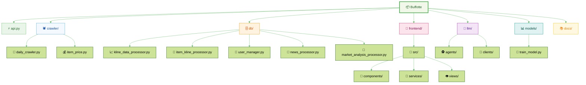
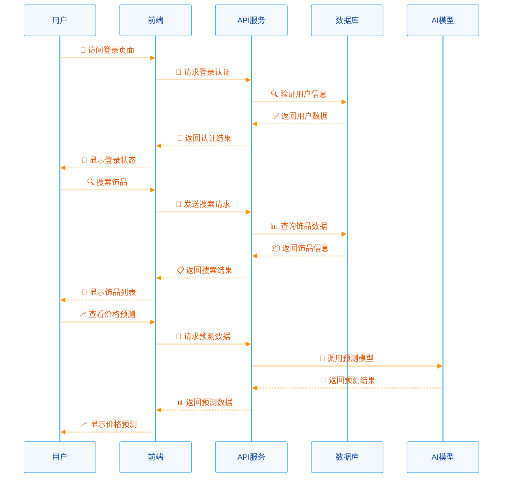
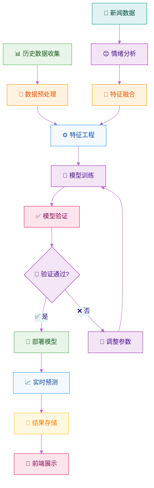
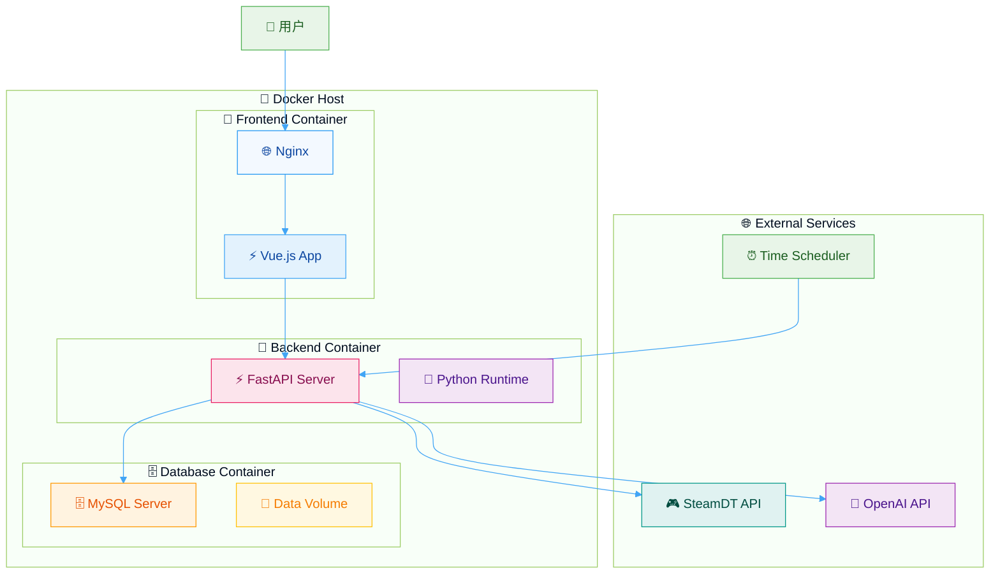
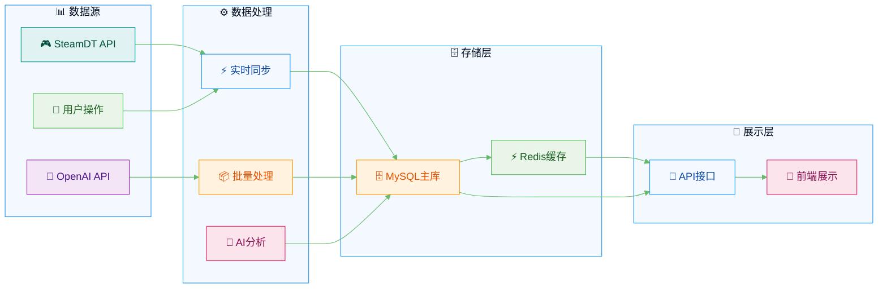

# Buffotte

**CS2 饰品市场智能分析平台**

<div align="center">


**在线体验：[https://buffotte.hezhili.online/login](https://buffotte.hezhili.online/login)**

</div>

## 核心功能

| 数据分析      | 实时追踪       | 预测模型     | 智能分析     |
| ------------- | -------------- | ------------ | ------------ |
| 实时 K 线数据 | K 线数据缓存   | 机器学习预测 | AI 大盘分析  |
| 价格趋势分析  | 个人收藏管理   | 趋势分析     | 豆包 LLM 驱动 |
| 市场数据看板  | 秒级动态更新   | 风险评估     | 新闻聚合摘要 |
| 系统实时监控  | 每日自动刷新   | 30 日预测    | 多维度洞察   |

## 项目架构优势

### 全新架构 2.1

- **K 线数据缓存** - 追踪饰品 K 线数据自动缓存至数据库，两阶段加载（秒级缓存 + 异步刷新）
- **AI 大盘分析** - 豆包大语言模型每日生成市场分析，通俗简洁的行情解读与预判
- **实时数据看板** - 市场页面核心指标卡片、趋势迷你图、数据分析看板，3 秒轮询动态更新
- **系统实时监控** - 首页展示服务器 CPU / 内存 / 负载 / 运行时间，读取宿主机真实数据
- **模块化设计** - 清晰的代码结构，易于维护和扩展
- **容器化部署** - Docker Compose 一键启动，跨容器网络通信
- **科技感 UI** - Matrix Rain 背景、扫描线效果、GSAP 动画、终端风格界面

### 数据流架构


```mermaid
%%{init: {
  'theme': 'base',
  'themeVariables': {
    'primaryColor': '#f3f9ff',
    'primaryTextColor': '#0d47a1',
    'primaryBorderColor': '#2196f3',
    'lineColor': '#42a5f5',
    'fillType0': '#e3f2fd',
    'fillType1': '#bbdefb',
    'fillType2': '#90caf9'
  }
}}%%
flowchart LR
    A[🌐 外部API] --> B[🕷️ 数据爬虫]
    B --> C[🗄️ MySQL数据库]
    C --> D[⚙️ 数据处理器]
    D --> E[🤖 AI模型]
    E --> F[🚀 RESTful API]
    F --> G[🎨 Vue3前端]

    style A fill:#e3f2fd,stroke:#2196f3,color:#0d47a1
    style B fill:#f3f9ff,stroke:#2196f3,color:#0d47a1
    style C fill:#e8f5e8,stroke:#4caf50,color:#1b5e20
    style D fill:#fff3e0,stroke:#ff9800,color:#e65100
    style E fill:#fce4ec,stroke:#e91e63,color:#880e4f
    style F fill:#f3f9ff,stroke:#2196f3,color:#0d47a1
    style G fill:#e8f5e8,stroke:#4caf50,color:#1b5e20
```

### 项目目录结构


```mermaid
%%{init: {
  'theme': 'forest',
  'themeVariables': {
    'primaryColor': '#f1f8e9',
    'primaryTextColor': '#1b5e20',
    'primaryBorderColor': '#4caf50',
    'lineColor': '#66bb6a',
    'clusterBkg': '#f9fbe7',
    'clusterBorder': '#9ccc65'
  }
}}%%
flowchart TD
    A[📦 Buffotte] --> B[⚡ api.py]
    A --> C[🕷️ crawler/]
    A --> D[🗄️ db/]
    A --> E[🎨 frontend/]
    A --> F[🤖 llm/]
    A --> G[📊 models/]
    A --> H[📚 docs/]

    C --> C1[📅 daily_crawler.py]
    C --> C2[💰 item_price.py]

    D --> D1[📈 kline_data_processor.py]
    D --> D2[🎯 item_kline_processor.py]
    D --> D3[👤 user_manager.py]
    D --> D4[📰 news_processor.py]
    D --> D5[🤖 market_analysis_processor.py]

    E --> E1[📁 src/]
    E1 --> E11[🧩 components/]
    E1 --> E12[🔗 services/]
    E1 --> E13[👁️ views/]

    F --> F1[🕵️ agents/]
    F --> F2[💬 clients/]

    G --> G1[🤖 train_model.py]

    style A fill:#f1f8e9,stroke:#4caf50,color:#1b5e20,stroke-width:3px
    style B fill:#e8f5e8,stroke:#66bb6a,color:#1b5e20
    style C fill:#f3f9ff,stroke:#42a5f5,color:#0d47a1
    style D fill:#fff3e0,stroke:#ff9800,color:#e65100
    style E fill:#fce4ec,stroke:#e91e63,color:#880e4f
    style F fill:#f3e5f5,stroke:#9c27b0,color:#4a148c
    style G fill:#e0f2f1,stroke:#009688,color:#004d40
    style H fill:#fff8e1,stroke:#ffc107,color:#f57c00
```

### 自动化工作流程


```mermaid
%%{init: {
  'theme': 'base',
  'themeVariables': {
    'primaryColor': '#e3f2fd',
    'primaryTextColor': '#0d47a1',
    'primaryBorderColor': '#2196f3',
    'gridColor': '#bbdefb',
    'todayLineColor': '#f44336',
    'sectionBkgColor': '#f8fff8',
    'altSectionBkgColor': '#f1f8e9',
    'taskBkgColor': '#e8f5e8',
    'taskTextColor': '#1b5e20',
    'taskBorderColor': '#4caf50',
    'activeTaskBkgColor': '#fff3e0',
    'activeTaskBorderColor': '#ff9800'
  }
}}%%
gantt
    title 🕐 Buffotte 自动化任务时间线
    dateFormat HH:mm
    axisFormat %H:%M

    section 📅 每日任务
    📰 新闻获取     :07:00, 60m
    ⚙️ 数据处理     :07:02, 58m
    📊 摘要生成     :07:05, 55m
    🤖 AI大盘分析   :07:08, 5m

    section 🎯 追踪任务
    🔥 热点饰品     :08:00, 60m
    💾 K线缓存刷新  :08:30, 30m

    section 🔮 预测任务
    🔮 预测走势     :00:00, 60m
    🔮 预测走势     :06:00, 60m
    🔮 预测走势     :12:00, 60m
    🔮 预测走势     :18:00, 60m

    section ⏰ 每小时任务
    📈 K线实时更新  :crit, 00:55, 55m

```

### 自动化脚本清单

| 脚本 | 作用 | 当前计划时间 | 说明 |
| --- | --- | --- | --- |
| `daily_automation.sh` | 每日新闻抓取、新闻处理、摘要生成、AI 大盘分析 | 每天 07:00 | 每日主数据入口，末尾调用豆包 LLM |
| `skin_automation.sh` | 热点饰品流水线：Scout → Parser → Investigator → 新闻分类 | 每天 08:00 | 在每日新闻处理完成后执行 |
| `kline_daily_refresh.sh` | 刷新所有已追踪饰品的 K 线缓存 | 每天 08:30 | 通过 buff-tracker API 批量获取并存入 DB |
| `hourly_automation.sh` | 更新日 K 实时数据 | 每小时 56 分 | 脚本内会跳过 07:00，避免与每日任务冲突 |
| `predict.sh` | 价格预测任务 | 每 6 小时 | 当前为 00:00 / 06:00 / 12:00 / 18:00 |

### 服务器当前 Cron 配置

服务器当前通过 `crontab` 执行以下自动化任务：

```bash
0 7 * * * /root/Buffotte/daily_automation.sh
56 * * * * /root/Buffotte/hourly_automation.sh
0 */6 * * * /root/Buffotte/predict.sh
0 8 * * * /root/Buffotte/skin_automation.sh >> /root/Buffotte/logs/skin_automation.log 2>&1
30 8 * * * /root/Buffotte/kline_daily_refresh.sh >> /root/Buffotte/logs/kline_daily_refresh.log 2>&1
```

`kline_daily_refresh.sh` 被安排在每天 `08:30` 执行，位于 `daily_automation.sh` 与 `skin_automation.sh` 之后，用于补齐追踪饰品的 K 线缓存，同时避开 07:00 的每日主流程。

### 用户操作流程


```mermaid
%%{init: {
  'theme': 'base',
  'themeVariables': {
    'primaryColor': '#e8f5e8',
    'primaryTextColor': '#1b5e20',
    'primaryBorderColor': '#4caf50',
    'lineColor': '#66bb6a',
    'actorBkg': '#f3f9ff',
    'actorBorder': '#2196f3',
    'actorTextColor': '#0d47a1',
    'actorLineColor': '#42a5f5',
    'signalColor': '#ff9800',
    'signalTextColor': '#e65100'
  }
}}%%
sequenceDiagram
    participant 👤 as 用户
    participant 🎨 as 前端
    participant 🚀 as API服务
    participant 🗄️ as 数据库
    participant 🤖 as AI模型

    👤->>🎨: 🔐 访问登录页面
    🎨->>🚀: 🔑 请求登录认证
    🚀->>🗄️: 🔍 验证用户信息
    🗄️-->>🚀: ✅ 返回用户数据
    🚀-->>🎨: 🎫 返回认证结果
    🎨-->>👤: 👋 显示登录状态

    👤->>🎨: 🔍 搜索饰品
    🎨->>🚀: 📡 发送搜索请求
    🚀->>🗄️: 📊 查询饰品数据
    🗄️-->>🚀: 📦 返回饰品信息
    🚀-->>🎨: 📋 返回搜索结果
    🎨-->>👤: 🎯 显示饰品列表

    👤->>🎨: 📈 查看价格预测
    🎨->>🚀: 🔮 请求预测数据
    🚀->>🤖: 🧠 调用预测模型
    🤖-->>🚀: 🎯 返回预测结果
    🚀-->>🎨: 📊 返回预测数据
    🎨-->>👤: 📈 显示价格预测
```

### 数据库设计架构


```mermaid
%%{init: {
  'theme': 'forest',
  'themeVariables': {
    'primaryColor': '#f1f8e9',
    'primaryTextColor': '#1b5e20',
    'primaryBorderColor': '#4caf50',
    'lineColor': '#66bb6a',
    'entityBkg': '#e8f5e8',
    'entityBorder': '#4caf50',
    'attributeBkg': '#f3f9ff',
    'attributeBorder': '#2196f3',
    'relationshipColor': '#ff9800'
  }
}}%%
erDiagram
    👤 USER {
        string email PK "📧 邮箱地址"
        string username "👤 用户名"
        string password_hash "🔒 密码哈希"
        datetime created_at "📅 创建时间"
    }

    📊 KLINE_DATA_DAY {
        bigint timestamp PK "⏰ 时间戳"
        date date "📅 日期"
        decimal open_price "💰 开盘价"
        decimal high_price "📈 最高价"
        decimal low_price "📉 最低价"
        decimal close_price "💵 收盘价"
        int volume "📦 成交量"
        decimal turnover "💸 成交额"
    }

    🎯 TRACK {
        int id PK "🆔 追踪ID"
        string email FK "📧 用户邮箱"
        string market_hash_name "🏷️ 饰品市场名"
    }

    📈 ITEM_KLINE_DAY {
        string market_hash_name PK "🏷️ 饰品市场名"
        bigint timestamp PK "⏰ 时间戳"
        decimal price "💵 当前价"
        int volume "📦 成交量"
        decimal turnover "💸 成交额"
    }

    📰 NEWS {
        int id PK "🆔 新闻ID"
        string title "📰 标题"
        string url UK "🔗 链接"
        string source "🌐 来源"
        string category "📂 分类"
        datetime publish_time "📅 发布时间"
    }

    🎮 CS2_ITEMS {
        string c5_id PK "🎯 饰品ID"
        string market_hash_name "🏷️ 市场名称"
        string name "📛 饰品名称"
    }

    🔮 KLINE_DATA_PREDICTION {
        date date PK "📅 预测日期"
        decimal predicted_close_price "📈 预测收盘价"
        decimal rolling_std_7 "📊 7日标准差"
    }

    🤖 MARKET_ANALYSIS {
        int id PK "🆔 分析ID"
        text analysis "📝 AI分析内容"
        date analysis_date UK "📅 分析日期"
    }

    👤 ||--o{ 🎯 : "📌 追踪饰品"
    🎯 }o--|| 🎮 : "🏷️ 对应饰品"
    🎮 ||--o{ 📈 : "📊 K线缓存"
    🎮 ||--o{ 🔮 : "🔮 价格预测"
```

### AI 预测流程


```mermaid
%%{init: {
  'theme': 'base',
  'themeVariables': {
    'primaryColor': '#f3e5f5',
    'primaryTextColor': '#4a148c',
    'primaryBorderColor': '#9c27b0',
    'lineColor': '#ba68c8',
    'sectionBkgColor': '#f8f9fa',
    'altSectionBkgColor': '#e8f5e8',
    'gridColor': '#e0e0e0'
  }
}}%%
flowchart TD
    A[📊 历史数据收集] --> B[🧹 数据预处理]
    B --> C[⚙️ 特征工程]
    C --> D[🤖 模型训练]
    D --> E[✅ 模型验证]
    E --> F{🤔 验证通过?}
    F -->|✅ 是| G[🚀 部署模型]
    F -->|❌ 否| H[🔧 调整参数]
    H --> D
    G --> I[📈 实时预测]
    I --> J[💾 结果存储]
    J --> K[🎨 前端展示]

    L[📰 新闻数据] --> M[😊 情绪分析]
    M --> N[🔗 特征融合]
    N --> C

    style A fill:#e8f5e8,stroke:#4caf50,color:#1b5e20
    style B fill:#fff3e0,stroke:#ff9800,color:#e65100
    style C fill:#f3f9ff,stroke:#2196f3,color:#0d47a1
    style D fill:#f3e5f5,stroke:#9c27b0,color:#4a148c
    style E fill:#fce4ec,stroke:#e91e63,color:#880e4f
    style G fill:#e8f5e8,stroke:#4caf50,color:#1b5e20
    style I fill:#f3f9ff,stroke:#2196f3,color:#0d47a1
    style J fill:#fff8e1,stroke:#ffc107,color:#f57c00
    style K fill:#fce4ec,stroke:#e91e63,color:#880e4f
    style L fill:#e0f2f1,stroke:#009688,color:#004d40
    style M fill:#f3e5f5,stroke:#9c27b0,color:#4a148c
    style N fill:#fff3e0,stroke:#ff9800,color:#e65100
```

### 智能分析能力

- **AI 大盘分析** - 豆包 LLM 每日生成市场行情解读，分今日行情 / 趋势对比 / 短期预判三段
- **K 线数据缓存** - 追踪饰品 K 线自动入库，两阶段加载（数据库秒读 + 异步 API 刷新）
- **实时数据看板** - 核心指标卡片、7 日趋势迷你图、数据分析面板、3 秒轮询动态更新
- **机器学习预测** - LightGBM 模型预测 30 日价格趋势，含 95% 置信区间
- **AI 新闻聚合** - 自动抓取和分析 CS2 相关资讯，AI 生成每日摘要
- **系统实时监控** - 读取宿主机 `/proc` 获取真实 CPU / 内存 / 负载 / 运行时间
- **自动化更新** - 5 层定时任务覆盖数据采集、模型训练、缓存刷新

## 技术栈

### 后端技术

```python
# 核心框架
FastAPI          # 高性能异步框架
PyMySQL          # 数据库连接
LightGBM         # 机器学习模型
httpx            # 异步 HTTP 客户端
Playwright       # 浏览器自动化（WAF 绕过）
```

### 前端技术

```javascript
// 现代化前端
Vue 3.5+         // 渐进式框架
Vite 7           // 构建工具
Axios            // HTTP 客户端
ECharts 6        // 数据可视化（K线图、趋势图）
GSAP             // 入场动画
marked + DOMPurify  // Markdown 渲染
```

### 部署架构

```yaml
# 容器化服务
Docker Compose   # 容器编排
Nginx            # 反向代理
MySQL            # 数据存储
```

### 系统部署架构


```mermaid
%%{init: {
  'theme': 'base',
  'themeVariables': {
    'primaryColor': '#e3f2fd',
    'primaryTextColor': '#0d47a1',
    'primaryBorderColor': '#2196f3',
    'lineColor': '#42a5f5',
    'clusterBkg': '#f8fff8',
    'clusterBorder': '#9ccc65',
    'secondaryColor': '#fce4ec',
    'tertiaryColor': '#fff3e0'
  }
}}%%
flowchart TB
    subgraph "🐳 Docker Host"
        subgraph "🎨 Frontend Container"
            F1[🌐 Nginx]
            F2[⚡ Vue.js App]
        end

        subgraph "🚀 Backend Container"
            B1[⚡ FastAPI Server]
            B2[🐍 Python Runtime]
        end

        subgraph "🗄️ Database Container"
            D1[🗄️ MySQL Server]
            D2[💾 Data Volume]
        end
    end

    subgraph "🌐 External Services"
        E1[🎮 SteamDT API]
        E2[🤖 OpenAI API]
        E3[⏰ Time Scheduler]
    end

    U[👤 用户] --> F1
    F1 --> F2
    F2 --> B1
    B1 --> D1
    B1 --> E1
    B1 --> E2
    E3 --> B1

    style U fill:#e8f5e8,stroke:#4caf50,color:#1b5e20
    style F1 fill:#f3f9ff,stroke:#2196f3,color:#0d47a1
    style F2 fill:#e3f2fd,stroke:#42a5f5,color:#0d47a1
    style B1 fill:#fce4ec,stroke:#e91e63,color:#880e4f
    style B2 fill:#f3e5f5,stroke:#9c27b0,color:#4a148c
    style D1 fill:#fff3e0,stroke:#ff9800,color:#e65100
    style D2 fill:#fff8e1,stroke:#ffc107,color:#f57c00
    style E1 fill:#e0f2f1,stroke:#009688,color:#004d40
    style E2 fill:#f3e5f5,stroke:#9c27b0,color:#4a148c
    style E3 fill:#e8f5e8,stroke:#4caf50,color:#1b5e20
```

### 数据同步策略


```mermaid
%%{init: {
  'theme': 'base',
  'themeVariables': {
    'primaryColor': '#e8f5e8',
    'primaryTextColor': '#1b5e20',
    'primaryBorderColor': '#4caf50',
    'lineColor': '#66bb6a',
    'clusterBkg': '#f3f9ff',
    'clusterBorder': '#2196f3',
    'secondaryColor': '#fce4ec',
    'tertiaryColor': '#fff3e0'
  }
}}%%
flowchart LR
    subgraph "📊 数据源"
        A1[🎮 SteamDT API]
        A2[🤖 OpenAI API]
        A3[👤 用户操作]
    end

    subgraph "⚙️ 数据处理"
        B1[⚡ 实时同步]
        B2[📦 批量处理]
        B3[🧠 AI分析]
    end

    subgraph "🗄️ 存储层"
        C1[🗄️ MySQL主库]
        C2[⚡ Redis缓存]
    end

    subgraph "🎨 展示层"
        D1[🚀 API接口]
        D2[📱 前端展示]
    end

    A1 --> B1
    A2 --> B2
    A3 --> B1
    B1 --> C1
    B2 --> C1
    B3 --> C1
    C1 --> C2
    C2 --> D1
    C1 --> D1
    D1 --> D2

    style A1 fill:#e0f2f1,stroke:#009688,color:#004d40
    style A2 fill:#f3e5f5,stroke:#9c27b0,color:#4a148c
    style A3 fill:#e8f5e8,stroke:#4caf50,color:#1b5e20
    style B1 fill:#f3f9ff,stroke:#2196f3,color:#0d47a1
    style B2 fill:#fff3e0,stroke:#ff9800,color:#e65100
    style B3 fill:#fce4ec,stroke:#e91e63,color:#880e4f
    style C1 fill:#fff3e0,stroke:#ff9800,color:#e65100
    style C2 fill:#e8f5e8,stroke:#4caf50,color:#1b5e20
    style D1 fill:#f3f9ff,stroke:#2196f3,color:#0d47a1
    style D2 fill:#fce4ec,stroke:#e91e63,color:#880e4f
```

## 快速开始

### 一键部署

```bash
# 克隆项目
git clone https://github.com/your-username/Buffotte.git
cd Buffotte

# 启动服务
docker-compose up -d

# 访问应用
# 前端: http://localhost:4000
# 后端: http://localhost:8002
```

### 环境配置

```bash
# 复制环境变量模板
cp .env.example .env

# 编辑配置文件
vim .env
```

## 数据流程

### 自动化任务

```bash
# 每日任务 (7:00 AM)
新闻获取 → 数据处理 → 摘要生成 → AI 大盘分析

# 热点饰品 (8:00 AM)
Scout → Parser → Investigator → 新闻分类

# K 线缓存刷新 (8:30 AM)
遍历所有追踪饰品 → buff-tracker API 获取 → 存入数据库

# 每小时任务 (除 7 点)
K 线更新 → 数据同步 → 实时展示

# 预测任务 (每 6 小时)
数据采集 → 特征工程 → LightGBM 训练 → 30 日预测
```

### 数据流向

```
外部 API → 爬虫模块 → 数据库 → 处理器 → AI 分析 → API → 前端
                                      ↗ 豆包 LLM (大盘分析)
                                      ↗ LightGBM (价格预测)
```

## 功能模块

| 模块     | 功能                          | 技术                |
| -------- | ----------------------------- | ------------------- |
| 用户系统 | 注册/登录/个人中心            | bcrypt + JWT        |
| K 线分析 | 实时价格/历史数据/数据看板    | ECharts + SteamDT   |
| 新闻聚合 | AI 抓取/智能摘要              | 豆包 LLM + 爬虫     |
| 价格预测 | 机器学习/趋势分析/置信区间    | LightGBM            |
| 饰品追踪 | K 线缓存/秒级加载/异步刷新    | MySQL + buff-tracker |
| 大盘分析 | AI 行情解读/趋势对比/短期预判 | 豆包 LLM            |
| 系统监控 | CPU/内存/负载/运行时间        | /proc 实时读取      |

## 项目特色

- **科技感 UI** - Matrix Rain 背景、扫描线效果、GSAP 动画、终端风格界面
- **高性能** - K 线数据缓存 + 两阶段加载，追踪饰品秒级渲染
- **AI 驱动** - 豆包 LLM 每日生成大盘分析，LightGBM 预测价格趋势
- **实时性** - 大盘指数 3 秒轮询动态更新，系统监控实时显示
- **全自动化** - 5 层定时任务覆盖数据采集、K 线缓存、模型训练、AI 分析
- **可视化** - 核心指标卡片、趋势迷你图、K 线蜡烛图、数据分析看板
- **安全性** - 完善的用户认证和数据保护

## 🤝 贡献指南

欢迎提交 Issue 和 Pull Request！

1. Fork 本项目
2. 创建特性分支 (`git checkout -b feature/AmazingFeature`)
3. 提交更改 (`git commit -m 'Add some AmazingFeature'`)
4. 推送到分支 (`git push origin feature/AmazingFeature`)
5. 开启 Pull Request

## 许可证

本项目采用 MIT 许可证 - 查看 [LICENSE](LICENSE) 文件了解详情

## 联系方式

- **在线体验**: [https://buffotte.hezhili.online/login](https://buffotte.hezhili.online/login)
- **邮箱**: HEZH0014@e.ntu.edu.sg
- **问题反馈**: [Issues](https://github.com/Shr1mpTop/Buffotte/issues)

---

<div align="center">

**祝您在 CS2 饰品市场投资顺利，早日财富自由！**

Made with ❤️ by Buffotte Team

</div>
